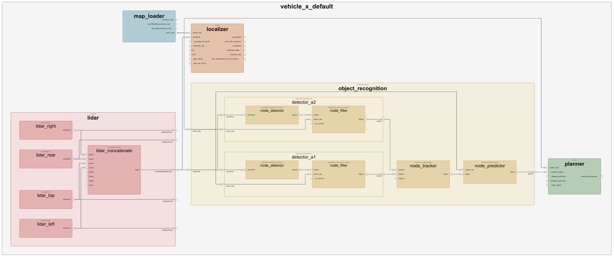
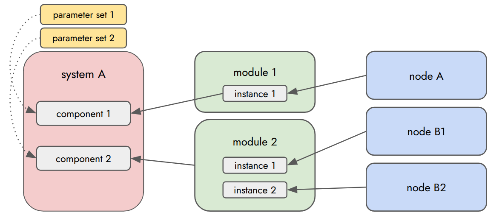

# Autoware System Designer

**Autoware System Designer** is a comprehensive toolset designed to define, build, and deploy Autoware systems in a modular and structured way. It allows developers to describe the software architecture using configuration files (YAML) and automatically generates system artifacts such as ROS 2 launch files, visualization diagrams, and parameter templates.

## Overview

Traditional ROS 2 launch files can become complex and hard to manage as a system grows. Autoware System Designer solves this by introducing a higher-level abstraction layer that separates **system design** from **deployment details**.



### Key Features

* **Modular Architecture**: Define systems using reusable **Nodes** and **Modules**.
* **Automatic Launch Generation**: Generate correct-by-construction ROS 2 XML launch files.
* **System Visualization**: Automatically generate diagrams (node graphs, sequence diagrams) to visualize the system structure and data flow.
* **Parameter Management**: Manage parameters efficiently using **Parameter Sets** and schema validation.
* **Deployment Configuration**: Easily switch between different hardware configurations or simulation modes using **Deployments**.

## Core Concepts

The system is built upon four main entity types:



### 1. Node (`*.node.yaml`)

Represents a single ROS 2 node. It defines:

* **Package**: Package name and provider information.
* **Launch**: Node execution configuration (plugin, executable, container settings, etc.).
* **Inputs/Outputs**: Ports (topics) with message types, QoS settings, and remap targets.
* **Parameters**: Configuration variables (inline or via parameter files).
* **Processes**: Internal logic flow with trigger conditions and outcomes.

### 2. Module (`*.module.yaml`)

A container for grouping nodes and other sub-modules. It defines:

* **Instances**: Nodes/modules contained within.
* **Connections**: Wiring between internal components.
* **External Interfaces**: Ports exposed to the outside world.

### 3. System (`*.system.yaml`)

The top-level description of a complete autonomous driving system. It defines:

* **Variables**: System-wide configuration variables and variable files.
* **Components**: Top-level nodes/modules with compute unit assignment, namespaces, and parameter sets.
* **Connections**: Data flow between components.
* **Modes**: Operation modes (e.g., Runtime, Simulation) with mode-specific overrides.

### 4. Parameter Set (`*.parameter_set.yaml`)

A collection of parameter overrides that can be applied to specific nodes in a system, allowing for flexible configuration management without modifying the core node definitions.

## Project Structure

To use Autoware System Designer in your ROS 2 package, organize your files as follows:

```text
src/<package_name>/
├── design/
│   ├── node/           # *.node.yaml
│   ├── module/         # *.module.yaml
│   ├── system/         # *.system.yaml
│   └── parameter_set/  # *.parameter_set.yaml
├── deployment/         # *.deployment.yaml (System instantiation)
├── schema/             # *.schema.json (Parameter schemas)
├── CMakeLists.txt
└── package.xml
```

## Build Integration

Autoware System Designer integrates directly into the CMake build process. Select the appropriate macros based on your package type.

In your `CMakeLists.txt`:

```cmake
find_package(autoware_system_designer REQUIRED)

# 1. Generate standalone node launchers (Optional)
# Use this if your package defines nodes and you want individual launch files.
autoware_system_designer_generate_launcher()

# 2. Generate parameter files from schemas (Optional)
# Use this if your package contains JSON schemas in the schema/ directory.
autoware_system_designer_parameter()

# 3. Build a full system deployment (Deployment Packages Only)
# Use this only in the package responsible for building the full system configuration.
autoware_system_designer_build_deploy(
  ${PROJECT_NAME}
  vehicle_x.deployment
)
```

## Glossary

### Entity Definitions

* **System**: The complete software stack.
* **Module**: A reusable group of nodes/modules.
* **Node**: An atomic software unit (process).
* **Parameter Set**: Configuration overrides.

### Connectivity

* **Port**: An interface for data exchange (Input/Output).
* **Connection**: A link between ports.
* **Topic**: The resolved ROS 2 topic name.

### Execution

* **Process**: A logical unit of execution within a node (e.g., a callback).
* **Event**: A runtime occurrence of a process.

### Instantiation

* **Deployment**: A specific instance of a System tailored for an environment/vehicle.
* **Component**: A top-level instance within a System.
